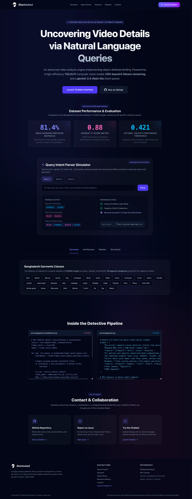

# Sherlocked - AI Video Detective



Welcome to the **Sherlocked** project! This README provides an overview of the project, setup instructions, and other relevant details.

## Table of Contents

- [Visit](#visit)
- [About](#about)
- [Features](#features)
- [Installation](#installation)
- [Structure](#structure)
- [Contributors](#contributors)
- [Contributing](#contributing)
- [License](#license)

## Visit

- [Repository](https://github.com/aabubokarr/sherlocked)
- [Website](https://aabubokarr.github.io/sherlocked/)

## About

**Sherlocked** is an advanced AI video detective platform that helps you find specific objects and scenes in video footage using natural language. Streamline your video analysis and uncover hidden details with our powerful computer vision pipeline and interactive chat interface.

## Features

- AI Object Detection
- Natural Language Search
- Interactive Chat Interface
- Frame Extraction
- Video Processing Pipeline
- Real-time Progress Tracking
- Confidence Filtering
- Frame Gallery & Lightbox

## Installation

1. Clone the repository:
   ```bash
   git clone https://github.com/aabubokarr/sherlocked.git
   ```
2. Navigate to the project directory:
   ```bash
   cd sherlocked
   ```
3. Set up the Frontend:
   ```bash
   cd client
   npm install
   ```
4. Set up the Backend (Python):
   ```bash
   python -m venv .venv
   source .venv/bin/activate
   pip install -r server/requirements.txt
   ```
5. Run the frontend:
   ```bash
   npm run dev
   ```
6. Run the backend:
   ```bash
   python -m uvicorn server.app.main:app --reload --host 0.0.0.0 --port 8000
   ```

## Structure

```
sherlocked/
├── .github/                             # Github actions
│   └── workflows/
│       └── deploy.yml
├── client/                              # Frontend application (Next.js)
│   ├── app/                             # App router
│   │   ├── detective/
│   │   │   └── page.tsx                 # Interactive chatbot interface
│   │   ├── globals.css                  # Global styles & theme variables
│   │   ├── icon.svg                     # Brand logo & favicon (single source)
│   │   ├── layout.tsx                   # Root layout
│   │   └── page.tsx                     # Portfolio landing page
│   ├── components/
│   │   ├── chat/                        # Chat-related components
│   │   │   ├── chat-input.tsx
│   │   │   └── chat-message.tsx
│   │   ├── layout/                      # App shell & shared navbar
│   │   │   ├── app-shell.tsx
│   │   │   ├── nav-sections.ts
│   │   │   ├── nav-stats-context.tsx
│   │   │   └── navbar.tsx
│   │   ├── portfolio/                   # Portfolio landing page sections
│   │   │   ├── background-ambience.tsx
│   │   │   ├── code-showcase.tsx
│   │   │   ├── constants.ts
│   │   │   ├── contact.tsx
│   │   │   ├── footer.tsx
│   │   │   ├── hero.tsx
│   │   │   ├── metrics.tsx
│   │   │   ├── query-simulator.tsx
│   │   │   ├── showcase-tabs.tsx
│   │   │   └── types.ts
│   │   └── ui/                          # Shared UI primitives
│   │       ├── glass-panel.tsx
│   │       └── sherlocked-logo.tsx      # Thin wrapper around app/icon.svg
│   ├── hooks/
│   │   └── use-section-scroll.ts        # Portfolio anchor navigation helper
│   ├── public/                          # Static assets
│   └── types/
│       └── index.ts                     # Shared TypeScript types
├── server/                              # Backend application (FastAPI)
│   └── app/
│       ├── services/
│       │   ├── color_extractor.py       # HSV K-Means color extraction
│       │   └── detector.py              # YOLO object detection service
│       ├── config.py                    # Configuration settings
│       └── main.py                      # API routes & entrypoint
├── main.py                              # CLI entrypoint for local processing
├── model.pt                             # YOLO model weights
├── train.ipynb                          # Model training notebook
└── README.md                            # Project documentation
```

## Contributors

<p align="center">
  <a href="https://github.com/aabubokarr/sherlocked/graphs/contributors">
    
  </a>
</p>

## Contributing

Contributions are welcome! Please follow these steps:

1. Fork the repository.
2. Create a new branch:
   ```bash
   git checkout -b feature-name
   ```
3. Commit your changes:
   ```bash
   git commit -m "Add feature-name"
   ```
4. Push to the branch:
   ```bash
   git push origin feature-name
   ```
5. Open a pull request.

## License

This project is licensed under the [MIT License](LICENSE).
